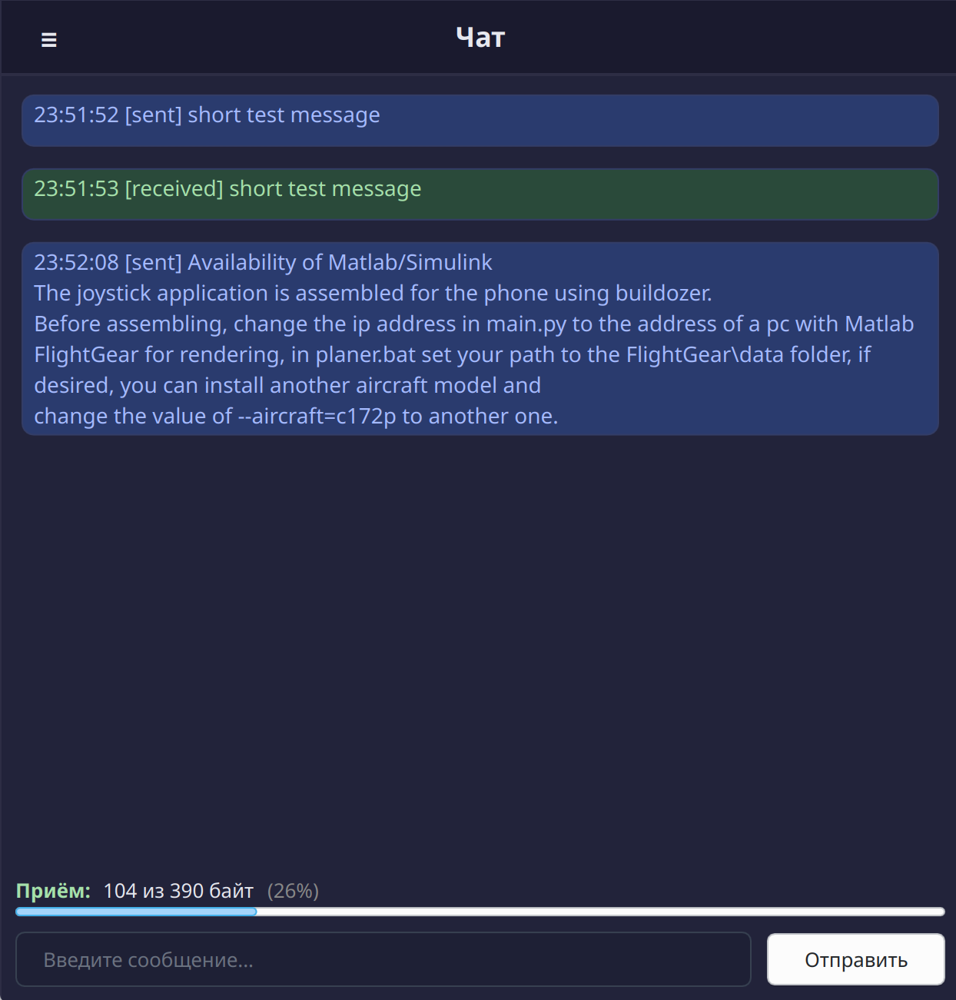

# LoRaClient - клиент для работы с LoRaCore (E22-400T22U)

Простое Qt6/C++/QML - приложение для отправки и приёма данных через LoRa-модуль Ebyte E22-400T22U с использованием библиотеки LoRaCore.
Отображается прогресс отправки/получения сообщений.

[](./doc/video/demo.mp4)

---

## Сборка

Требования:
- CMake ≥ 3.19
- Qt6 (Core, Qml, Gui, SerialPort, Concurrent)
- Компилятор с поддержкой C++20 и выше

### 1. Сборка основного клиента (`LoraClient`)

```bash
git clone --recurse-submodules https://github.com/byhat/LoraClient.git
cd LoraClient

mkdir -p build && cd build
cmake .. -DCMAKE_BUILD_TYPE=Release
cmake --build . --parallel
```

После сборки запустите:
```bash
./LoraClient
```

### 2. Сборка тестового Echo-сервера (`LoraEchoServer`, опционально)

Сервер находится в `tools/LoraEchoServer/` и **собирается отдельно** (не через корневой CMake):

```bash
cd tools/LoraEchoServer

mkdir -p build && cd build
cmake .. -DCMAKE_BUILD_TYPE=Release
cmake --build . --parallel
```

Исполняемый файл:
```bash
./LoraCmd
```

---

## Протокол

- Макс. размер фрейма: 26 байт данных + заголовок
- Автоматическая фрагментация больших пакетов
- Подтверждение на уровне фрагмента (ACK) и пакета (PACKET_ACK)
- Повтор до 5 раз при потере подтверждения (таймаут — 1 с)
- Контрольная сумма: CRC8 (Dallas/Maxim)

