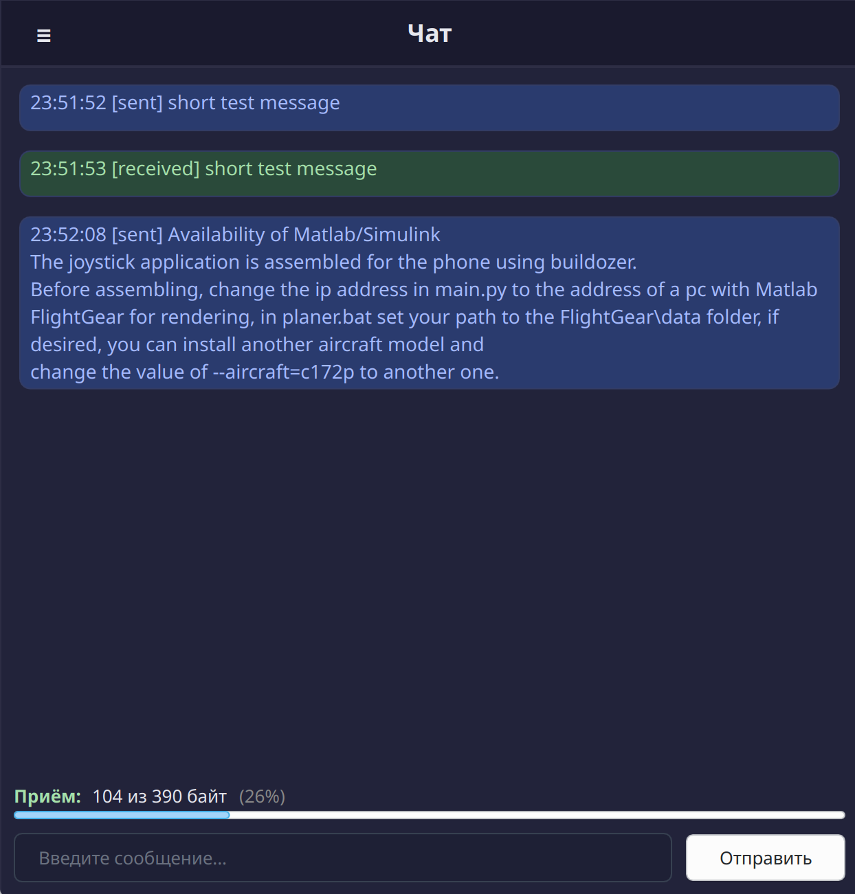

<div align="center">

# LoRaClient

### Qt6/C++/QML client for working with LoRa module Ebyte E22-400T22U

[](https://github.com/byhat/LoraClient/actions/workflows/build-linux.yml)
[](LICENSE)
[](https://www.qt.io/)
[](https://isocpp.org/)
[](https://cmake.org/)

[Watch the demo](doc/video/demo.mp4) | [Report Bug](https://github.com/byhat/LoraClient/issues) | [Request Feature](https://github.com/byhat/LoraClient/issues)

</div>

---

## 📋 Project Description

**LoRaClient** is a modern desktop application for sending and receiving data via the LoRa module Ebyte E22-400T22U (or any other device operating via serial port similarly to this one). The application is built based on Clean Architecture and provides a convenient graphical interface based on QML.

### 🌟 Key Features

- 📤 **Sending messages** — text, images, and files
- 📥 **Data reception** — automatic processing of incoming messages
- 🔄 **Fragmentation** — automatic splitting of large packets
- ✅ **Delivery confirmation** — ACK at fragment and packet levels
- 🎨 **Modern UI** — QML-based interface with dark theme support
- 🧪 **Test coverage** — unit-tests for all use cases
- 🏗️ **Clean Architecture** — separation into domain, application, infrastructure, presentation layers

---

## 🎸 Demo

[](./doc/video/demo.mp4)

---

## 🚀 Quick Start

### Requirements

- **CMake** ≥ 3.19
- **Qt6** (Core, Qml, Gui, SerialPort, Concurrent, Test, Gui)
- **Compiler** with C++20 support (GCC 10+, Clang 12+, MSVC 2019+)
- **spdlog** — logging library
- **GTest/GMock** — testing frameworks

### Installing Dependencies

#### Ubuntu/Debian

```bash
sudo apt-get update
sudo apt-get install -y \
    build-essential \
    cmake \
    qt6-base-dev \
    qt6-declarative-dev \
    qt6-serialport-dev \
    libqt6svg6-dev \
    libspdlog-dev \
    libgtest-dev \
    libgmock-dev \
    qml6-module-qtquick \
    qml6-module-qtquick-controls \
    qml6-module-qtquick-layouts
```

#### Fedora

```bash
sudo dnf install -y \
    cmake \
    qt6-qtbase-devel \
    qt6-qtdeclarative-devel \
    qt6-qtserialport-devel \
    spdlog-devel \
    gtest-devel \
    gmock-devel
```

#### Arch Linux

```bash
sudo pacman -S --needed \
    cmake \
    qt6-base \
    qt6-declarative \
    qt6-serialport \
    spdlog \
    gtest
```

### Building

```bash
# Clone the repository with submodules
git clone --recurse-submodules https://github.com/byhat/LoraClient.git
cd LoraClient

# Create a build directory
mkdir -p build && cd build

# Configure the project
cmake .. -DCMAKE_BUILD_TYPE=Release

# Build the project
cmake --build . --parallel

# Run
./LoraClient
```

### Running Tests

```bash
cd build
./tests/loraclient_tests
```

---

## 📱 Android Build

### Prerequisites

- **Android NDK** ≥ r26 (tested with r26.1.10909125)
- **Android SDK** with build-tools
- **Qt6 for Android** (tested with 6.9.0)
- **Ninja** build system
- **ADB** (Android Debug Bridge) for deployment and logging
- **Android device or emulator** connected via USB

### Environment Variables

Ensure you have the following paths available:
- Android SDK: `C:/Users/User/AppData/Local/Android/Sdk` (or your installation path)
- Android NDK: `C:/Users/User/AppData/Local/Android/Sdk/ndk/26.1.10909125` (or your NDK version)
- Qt for Android: `C:/Qt/6.9.0/android_armv7` (or your Qt installation)
- Ninja: `C:/Qt/Tools/Ninja/ninja.exe` (or your Ninja installation)

### Building for Android

```bash
# Navigate to project directory
cd LoraClient

# Create build directory
mkdir build\Android_Qt_6_9_0_Clang_armeabi_v7a-Debug
cd build\Android_Qt_6_9_0_Clang_armeabi_v7a-Debug

# Configure CMake for Android
cmake -G Ninja   -DCMAKE_MAKE_PROGRAM=C:/Qt/Tools/Ninja/ninja.exe  -DCMAKE_TOOLCHAIN_FILE=C:/Users/User/AppData/Local/Android/Sdk/ndk/26.1.10909125/build/cmake/android.toolchain.cmake  -DANDROID_ABI=armeabi-v7a  -DANDROID_PLATFORM=android-23  -DCMAKE_PREFIX_PATH=C:/Qt/6.9.0/android_armv7   -DCMAKE_BUILD_TYPE=Debug  -DCMAKE_FIND_ROOT_PATH="C:/Users/User/AppData/Local/Android/Sdk/ndk/26.1.10909125;C:/Qt/6.9.0/android_armv7"    -DCMAKE_FIND_ROOT_PATH_MODE_PACKAGE=BOTH  -DANDROID_SDK_ROOT=C:/Users/User/AppData/Local/Android/Sdk   ../..

# Build the project
cmake --build .
```

### Installing APK to Device

```bash
# Check if device is connected
C:\Users\User\AppData\Local\Android\Sdk\platform-tools\adb.exe devices

# Install the APK (replace path with your build output)
C:\Users\User\AppData\Local\Android\Sdk\platform-tools\adb.exe install -r C:\CODE\LoraClient\build\Android_Qt_6_9_0_Clang_armeabi_v7a-Debug\LoraClient\android-build\build\outputs\apk\debug\android-build-debug.apk
```

### Running the Application

```bash
# Start the application
C:\Users\User\AppData\Local\Android\Sdk\platform-tools\adb.exe shell am start -n org.qtproject.example.LoraClient/org.qtproject.qt.android.bindings.QtActivity
```

### Viewing Logs

```bash
# View all logs
C:\Users\User\AppData\Local\Android\Sdk\platform-tools\adb.exe logcat

# View logs filtered for LoraClient and Qt
C:\Users\User\AppData\Local\Android\Sdk\platform-tools\adb.exe logcat -s "LoraClient:*" "Qt:*"

# View logs filtered for errors
C:\Users\User\AppData\Local\Android\Sdk\platform-tools\adb.exe logcat -s "*:E"

# View logs for a specific process (replace PID with actual process ID)
C:\Users\User\AppData\Local\Android\Sdk\platform-tools\adb.exe logcat --pid=<PID>

# Clear log buffer
C:\Users\User\AppData\Local\Android\Sdk\platform-tools\adb.exe logcat -c

adb logcat --pid=$(adb shell pidof org.loraclient.app)
```

### Troubleshooting

- **CMake cannot find Qt6**: Ensure `CMAKE_PREFIX_PATH` points to your Qt for Android installation
- **Ninja not found**: Set `CMAKE_MAKE_PROGRAM` to the full path of ninja.exe
- **Android SDK build tools error**: Set `ANDROID_SDK_ROOT` to your Android SDK path
- **Device not found**: Ensure USB debugging is enabled on your Android device and the device is connected via USB

---

## 📁 Project Structure

```
LoraClient/
├── LoraClient/              # Main application
│   ├── src/
│   │   ├── application/     # Application layer (AppEngine)
│   │   ├── core/            # Business logic
│   │   │   ├── entities/    # Domain entities
│   │   │   └── usecases/    # Use cases (Connection, Send, Receive)
│   │   ├── domain/          # Domain layer (interfaces)
│   │   ├── infrastructure/  # Infrastructure layer (gateways, logging)
│   │   └── presentation/    # Presentation layer (controllers, models, QML)
│   ├── qml/                 # QML interfaces
│   └── resources/           # Resources (fonts, icons)
├── tests/                   # Unit-tests
├── tools/                   # Additional tools
│   └── LoraEchoServer/      # Echo-server for testing
└── doc/                     # Documentation
```

---

## 🏗️ Architecture

The project is built according to the principles of **Clean Architecture**:

- **Domain Layer** — contains business logic and interfaces
- **Application Layer** — orchestration of use cases
- **Infrastructure Layer** — implementation of external dependencies (LoRa, logging)
- **Presentation Layer** — UI on QML and controllers

### Use Cases

- **ConnectionUseCase** — managing connection to the LoRa module
- **SendUseCase** — sending text, images, and files
- **ReceiveUseCase** — receiving and processing incoming data

---

## 📡 Protocol

| Parameter | Value |
|----------|-------|
| Max frame size | 26 bytes of data + header |
| Fragmentation | Automatic for large packets |
| Confirmation | ACK (fragment) + PACKET_ACK (packet) |
| Retries | Up to 5 times on ACK loss |
| Timeout | 1 second |
| Checksum | CRC16 (ISO 3309) |

---

## 🧪 Testing

The project is covered with unit-tests using Google Test:

```bash
# Run all tests
cd build
./tests/loraclient_tests

# Run with verbose output
./tests/loraclient_tests --gtest_verbose

# Run a specific test
./tests/loraclient_tests --gtest_filter="SendUseCaseTest.SendTextCallsSendPacket"
```

### Test Coverage

- ✅ ConnectionUseCase — 4 tests
- ✅ ReceiveUseCase — 6 tests
- ✅ SendUseCase — 10 tests

---

## 🔧 Echo-server (optional)

For testing, you can build the Echo-server:

```bash
cd tools/LoraEchoServer
mkdir -p build && cd build
cmake .. -DCMAKE_BUILD_TYPE=Release
cmake --build . --parallel

# Run
./LoraCmd
```

---

## 🤝 Contributing

Contributions to the development of the project are welcome! Please follow these rules:

1. Fork the project
2. Create a branch for your feature (`git checkout -b feature/AmazingFeature`)
3. Commit your changes (`git commit -m 'Add some AmazingFeature'`)
4. Push to the branch (`git push origin feature/AmazingFeature`)
5. Open a Pull Request

---

## 📝 License

This project is licensed under the LGPL v2.1 license — see the [LICENSE](LICENSE) file for details.

---

## 👏 Acknowledgments

- **Qt Framework** — excellent framework for cross-platform development
- **spdlog** — fast C++ logging library
- **Google Test** — framework for testing C++ code
- **Ebyte** — for high-quality LoRa modules

---

## 📞 Contacts

**byhat** — [GitHub](https://github.com/byhat)

Project link: [https://github.com/byhat/LoraClient](https://github.com/byhat/LoraClient)

---

<div align="center">

**⭐ If you liked this project, give it a star! ⭐**

</div>
